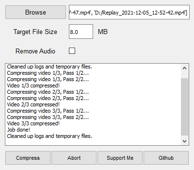

# Python Video Compressor
## Originally by big-slime
A simple video compressor, created in Python. Somehow lost to time? Idk, here's a reupload that I'm going to enhance down the road.

### Features
- Compress multiple video files in a queue syste m.
- Compress videos to any file size.
- Remove audio from videos.
- Automatically downloads and installs ffmpeg.

### Preview

### OG Creator's Kofi

